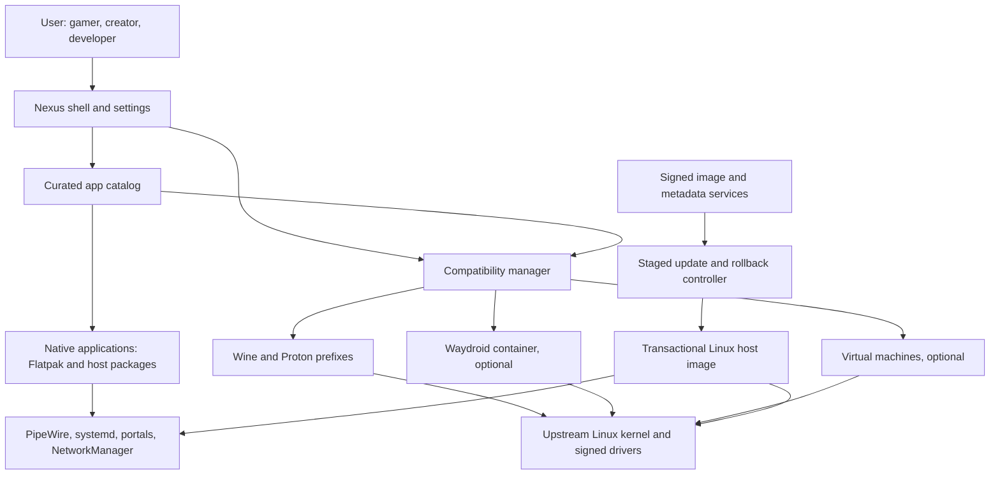
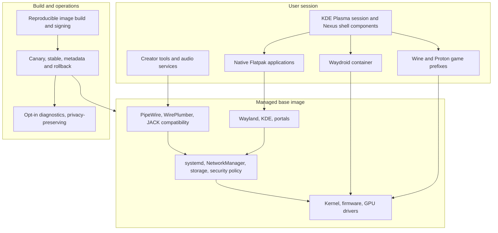
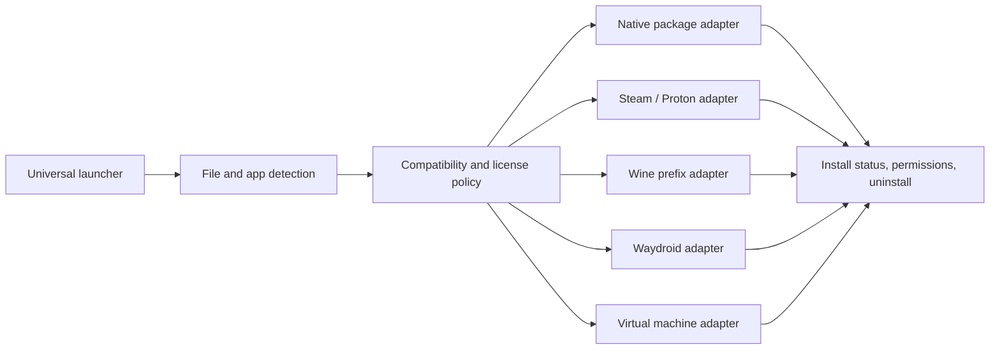
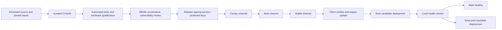
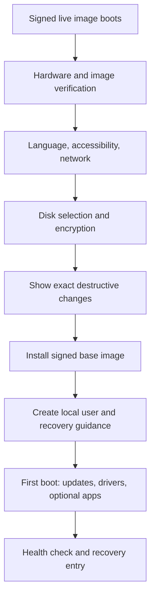

# Nexus-OS Architecture

**Status:** proposed baseline for discovery, not a claim that these components are implemented. All upstream versions, licensing terms, and hardware requirements must be rechecked before release.

## 1. Product boundary

Nexus-OS is a curated Linux distribution, not a compatibility reimplementation of Windows, macOS, and Android. The host remains Linux. Native Linux applications are the default; compatibility runtimes and virtual machines are isolated, optional integrations. No compatibility claim is made without a tested application, hardware, and runtime matrix.

The initial qualification reference is an x86-64 UEFI laptop with Intel integrated graphics, reflecting the project's first target-user profile. This is a validation priority, not an Intel-only product policy or a support claim. Keep AMD and NVIDIA systems in the required pre-Beta matrix; ARM64 can follow after the application and driver matrix is viable. Establish a modest minimum specification only after boot, GPU, audio, suspend, and creator-workflow tests on real hardware.

### System context

### Host and application layers

## 2. Shared platform decisions

| Area | Initial direction | Boundary / decision gate |
|---|---|---|
| Distribution | Evaluate Fedora Atomic KDE (Kinoite family) as the first upstream base | Compare update lifecycle, image customization, NVIDIA, accessibility, and support burden before committing. Avoid maintaining a parallel package universe. |
| System updates | Use the selected upstream's supported atomic deployment and rollback mechanism | Do not mix rpm-ostree and bootc models in one release design. Select one after a working image/update prototype. |
| Desktop | KDE Plasma on Wayland, with small Nexus-owned shell/settings components | Upstream desktop remains usable if Nexus services are unavailable. Do not fork the compositor. |
| Applications | Curated Flatpak-first catalog; host packages only for components requiring host privileges | Flatpak remotes and permissions are explicit; avoid silently granting broad filesystem/device access. |
| Audio | PipeWire and WirePlumber; JACK application compatibility; optional realtime tuning | Measure round-trip latency and XRUNs on a published interface/device matrix. Do not advertise hard realtime. |
| Security | SELinux enforcing, Secure Boot-compatible signed boot chain, least privilege, user-controlled encryption | Define threat model, recovery-key handling, signing-key custody, and incident response before beta. |
| Build | Pinned inputs, CI-built artifacts, SBOMs, provenance, signed repository metadata and images | Release artifacts are never built on a developer workstation and uploaded unsigned. |
| Telemetry | Off by default; diagnostics are opt-in and inspectable | No behavioral collection required to install, update, or use the system. Publish retention and deletion rules. |

### Kernel and hardware strategy

1. Ship the supported upstream kernel and firmware from the base distribution. Maintain a narrow patch budget; first profile userspace scheduling, GameMode, compositor configuration, and per-game settings.
2. Maintain a hardware qualification matrix for AMD, Intel, and NVIDIA GPUs, laptops, Secure Boot, suspend/resume, VRR, multi-monitor, USB audio, MIDI, and common controllers. Publish known limitations.
3. Treat proprietary GPU userspace, kernel modules, codecs, and firmware as distinct licensing and signing concerns. Secure Boot must have a supported enrollment/signing path; never tell users to disable it as the default fix.
4. Only consider a separately versioned low-latency/realtime kernel after repeatable audio or gaming benchmarks show an upstream configuration cannot meet a stated target. Build it in CI, sign it, run ABI and hardware tests, retain the standard kernel as recovery, and document regression/rollback policy.
5. Never promise that a “gaming kernel” increases FPS. Benchmark frame-time distributions, input latency, audio XRUNs, power, and regressions against the unmodified baseline.

## 3. Package, catalog, and compatibility architecture

### Package management

- **Base OS:** signed, versioned system image; updates create a new deployment and preserve a known-good bootable deployment.
- **Desktop applications:** Flatpak where available, with curated remotes, verified publisher identity, permission review, and pinned/controlled runtime policy.
- **Development environments:** Toolbox/Distrobox-style containers or equivalent, not ad hoc mutation of the host.
- **Windows games:** Steam/Proton for Steam-managed titles; Lutris/Heroic and Wine for other supported workflows. Use upstream sources and user-owned accounts/downloads.
- **System extensions:** a small, reviewed catalog of privileged host components with clear ownership, update, signature, and removal behavior.

The Nexus catalog is metadata and orchestration, not a second binary package manager. Each adapter declares supported install sources, required permissions, uninstall semantics, and whether the app is native, translated, containerized, or virtualized. Never run a downloaded installer as root. Dependency installation must be explainable, source-verified, and reversible where practical.

### Compatibility manager

The launcher accepts catalog IDs and local files, displays publisher/source, architecture, required runtime, permissions, and known status before install. EXE/MSI handling is opt-in: inspect metadata, show the target prefix and dependencies, and launch under an unprivileged user. Do not auto-download arbitrary DLLs, execute remote scripts, or claim malware detection. Preserve the original file and provide logs and removal controls.

### Example catalog record

The sample in [`examples/catalog-entry.yaml`](../examples/catalog-entry.yaml) illustrates metadata only; it is not an executable install recipe. A production catalog needs a versioned schema, signature verification, source allowlisting, and policy review.

## 4. Feature designs

Each feature below follows the requested seven-part format. Examples are illustrative integration contracts, not implemented code or compatibility guarantees.

### 4.1 Windows applications and games

1. **Purpose:** Make supported Windows software approachable while keeping native Linux apps preferred and compatibility failures diagnosable.
2. **Technical Architecture:** Universal launcher routes Steam titles to Proton, other supported apps to isolated Wine prefixes, and commercial launchers to Lutris/Heroic adapters. Prefixes are per-app, user-owned, backed up only by explicit choice, and removable. A compatibility database records exact versions and test hardware.
3. **Technologies Used:** Wine, Valve Proton, optional community Proton-GE, Steam, Lutris, Heroic, Flatpak/portals, Vulkan translation components such as DXVK and VKD3D-Proton where supplied by the runtime.
4. **Risks:** Anti-cheat/DRM incompatibility, regressions after runtime updates, untrusted installers, prefix corruption, proprietary launcher changes, and community build licensing/support differences. Proton-GE is not Valve-supported; do not bundle it without checking its distribution terms.
5. **Development Steps:** Define supported launch/install flows; prototype prefix lifecycle; add source and permission review; build tested per-app reports; add update pin/rollback and log export; only then expose a one-click path.
6. **Example Code:** An install request should resolve a catalog ID to a signed manifest and an adapter, never call a shell with a string assembled from user input. See the catalog record and adapter boundary above.
7. **Future Improvements:** Community test submissions, per-title runtime pinning, controller-aware setup, save-game backup, and curated mod support.

### 4.2 macOS compatibility and alternatives

1. **Purpose:** Help users find a workable route for macOS-oriented workflows without claiming macOS binaries run natively on Linux.
2. **Technical Architecture:** Prefer Linux-native or web alternatives from the catalog. Offer a VM manager only when the user supplies a lawful OS image and the host hardware/license permits that virtualization. Keep VM disk, network, USB, and shared-folder permissions explicit.
3. **Technologies Used:** KDE application catalog, Flatpak/native Linux applications, KVM/QEMU and libvirt where suitable, documented file-format and project migration tools.
4. **Risks:** Apple's macOS license generally restricts virtualization to Apple-branded hardware; applicable terms and jurisdiction must be reviewed. No bypassing activation, hardware checks, DRM, or distributing Apple's OS. GPU acceleration and professional app support in VMs are limited. Alternatives may not preserve project fidelity.
5. **Development Steps:** Build a workflow/format compatibility guide; list tested Linux alternatives; validate VM support only on permitted hardware; consult counsel before shipping any macOS-specific automation or imagery.
6. **Example Code:** A launcher policy should refuse an unsupported VM target before provisioning: `if guest_os == "macOS" and not host_is_apple_branded: deny("Unsupported by product policy")` (illustrative pseudocode; legal review required).
7. **Future Improvements:** Validated project interchange guides, migration tooling, and optional remote access to a user's separately owned Mac.

### 4.3 Android applications

1. **Purpose:** Provide optional Android app access and controller-friendly play without entangling Android services with the Linux host.
2. **Technical Architecture:** Waydroid runs as a container with a dedicated image, controlled binder access, and a Wayland session. Lifecycle, image updates, app installation, and networking are managed separately from OS updates. Android integration is disabled until explicitly enabled.
3. **Technologies Used:** Waydroid, Linux namespaces/cgroups, binder support, Wayland, controller input mapping; optional F-Droid or user-supplied app sources after policy review.
4. **Risks:** Kernel/configuration incompatibility, ARM-only apps on x86, Google Play certification and service licensing, app DRM, container escape risk, and anti-cheat restrictions. Do not imply Google Play is included or supported without authorization and certification.
5. **Development Steps:** Verify binder requirements on supported kernels; threat-model container permissions; test GPU/input/audio and suspend; define app-source policy; provide clean disable/remove and image rollback.
6. **Example Code:** The catalog schema labels the runtime as `waydroid` so UI and policy can show its isolation and permissions; actual provisioning must use the Waydroid-supported interface, not a privileged shell script.
7. **Future Improvements:** Per-app controller profiles, tested x86 translation options where legally distributable, and additional container security boundaries.

### 4.4 Gaming platform

1. **Purpose:** Deliver a ready-to-use, transparent gaming experience across supported PC hardware.
2. **Technical Architecture:** Install/storefront choices are user-controlled. Provide Steam integration, Proton selection, optional Lutris/Heroic, GameMode profile, MangoHud overlay, Gamescope where supported, and per-game settings. Performance mode changes reversible user-session settings and reports what it changed.
3. **Technologies Used:** Steam, Proton, Lutris, Heroic, Feral GameMode, MangoHud, Gamescope, Mesa, Vulkan, upstream GPU drivers and supported vendor drivers.
4. **Risks:** Not all titles or anti-cheat work; storefront terms and branding apply; overlays conflict with some titles; vendor drivers vary; global CPU/GPU tuning can increase heat, power, or instability. Avoid bundling commercial services contrary to their terms.
5. **Development Steps:** Publish GPU/title test matrix; add opt-in adapters and driver detection; implement reversible profiles; test frame pacing and suspend; provide a clear compatibility/status page.
6. **Example Code:** Profile contract: `profile.apply(settings) -> ChangeSet` and `profile.revert(ChangeSet)`; never persist a performance tweak without showing its value and rollback path.
7. **Future Improvements:** Per-title profiles, benchmark sharing with consent, handheld UI, HDR/VRR validation, and smarter frame-time-based recommendations.

### 4.5 Video, 3D, and streaming

1. **Purpose:** Make the system dependable for editing, compositing, 3D creation, and live production.
2. **Technical Architecture:** Offer native catalog entries for supported creator applications; detect GPU/codec capabilities; expose independent monitor/audio routing controls; use project-friendly storage and backup guidance. Hardware acceleration is advertised only for tested codecs, drivers, and app versions.
3. **Technologies Used:** Kdenlive, Blender, OBS Studio, DaVinci Resolve (vendor-supported Linux requirements only), FFmpeg ecosystem components, Vulkan/OpenGL, PipeWire capture, color-management standards.
4. **Risks:** Resolve GPU/codec requirements differ by vendor and release; redistribution and codec patents/licensing vary by region; plugin availability and project interchange can differ; multi-GPU and display-color workflows need testing. AI enhancement may require large proprietary model weights.
5. **Development Steps:** Validate install/update paths and codecs; test import/export formats and hardware encode/decode; benchmark real project timelines; certify OBS capture and multi-monitor workflows; document known limits.
6. **Example Code:** Catalog metadata declares `capabilities: ["vulkan", "video-encode"]` as a discovery hint only; probe the actual device at runtime before enabling acceleration.
7. **Future Improvements:** Versioned creator workstation profiles, color-managed presets, render-node support, and opt-in model management with provenance.

### 4.6 Music production and audio

1. **Purpose:** Support reliable recording, monitoring, MIDI, mixing, and plugin workflows.
2. **Technical Architecture:** PipeWire/WirePlumber manage devices and user routing; JACK applications connect through PipeWire compatibility; expose a Studio Mode profile for limits and power behavior with visible rollback. VST plugins run inside host-native applications and their own architectures; no blanket Windows plugin guarantee.
3. **Technologies Used:** PipeWire, WirePlumber, ALSA, JACK compatibility, Ardour, REAPER, Bitwig Studio (vendor licensing), MIDI/ALSA sequencer, yabridge where applicable, realtimekit and supported kernel scheduling facilities.
4. **Risks:** USB interface firmware/driver quality, XRUNs under load, sample-rate drift, plugin copy protection, architecture mismatch, realtime privilege misconfiguration, and kernel upgrades. `rtkit` is not equivalent to an unrestricted realtime kernel.
5. **Development Steps:** Publish round-trip latency and XRUN methodology; validate interfaces and MIDI devices; test suspend/reconnect and session restore; scope plugin bridge support; retain safe defaults and a one-action recovery mode.
6. **Example Code:** Studio Mode must apply a bounded profile through supported system interfaces, record prior values, and restore them on exit; never write arbitrary scheduler or memory-lock settings from a desktop UI.
7. **Future Improvements:** Per-interface tested profiles, session snapshots, MIDI device naming, and optional isolated plugin hosting.

### 4.7 Local AI and automation

1. **Purpose:** Offer optional local inference and workflow assistance while keeping user data local by default and model downloads explicit.
2. **Technical Architecture:** A user-session broker discovers installed inference backends, applies resource budgets, and exposes permissioned tool APIs. Models are separately downloaded, checksummed, licensed, and removable. Voice activation is off by default; automation actions require scoped consent and confirmation for destructive or external operations.
3. **Technologies Used:** Pluggable local inference runtimes (selected after license/performance review), offline speech recognition, desktop portals, sandboxing, hardware capability detection, user-owned model storage.
4. **Risks:** Model license and provenance, unsafe tool execution, prompt injection, privacy leakage, GPU memory contention, inaccurate transcription, and opaque model downloads. Never execute generated shell commands silently.
5. **Development Steps:** Threat-model tool access; define opt-in data boundaries; benchmark supported hardware; ship read-only assistant first; add confirmed, reversible actions; publish model inventory and removal controls.
6. **Example Code:** Tool contract: `request(action, scope) -> preview`; execute only after user confirmation, and record an inspectable local audit entry.
7. **Future Improvements:** Offline transcription, project-aware search, workflow recipes, and separately sandboxed creator assistants.

### 4.8 Desktop, dashboards, and settings

1. **Purpose:** Provide a coherent interface for daily work, game libraries, creator setup, and system controls without replacing a mature desktop prematurely.
2. **Technical Architecture:** KDE Plasma/Wayland is the desktop foundation. Nexus-owned shell components are modular and communicate with a narrow user-session service over a versioned local API. Quick settings use portals or supported system APIs; gaming and creator dashboards are views over shared catalog/profile services.
3. **Technologies Used:** KDE Plasma, Qt/Kirigami for native shell components, Wayland, xdg-desktop-portal, system settings APIs, accessibility APIs.
4. **Risks:** Plasma upgrades can change extension APIs; shell plugins are less stable than external apps; overlapping settings confuse users; accessibility, localization, multi-monitor, fractional scaling, and keyboard navigation are easy to under-test.
5. **Development Steps:** Keep upstream desktop intact; prototype standalone settings app first; define stable service APIs; test keyboard/screen-reader/localization; add optional dashboard panels only when they improve a real workflow.
6. **Example Code:** Shell panels call a versioned service API and display unavailable state if the service is absent; they do not shell out to privileged commands.
7. **Future Improvements:** User-configurable widgets, refined handheld/tablet layout, and optional creator/game workspaces.

### 4.9 Security and privacy

1. **Purpose:** Minimize compromise impact, establish trustworthy updates, and make privacy choices understandable.
2. **Technical Architecture:** Enforcing SELinux; Secure Boot-compatible signed boot artifacts; least-privilege services; sandboxed apps; encrypted storage using upstream supported tooling; host firewall defaults; security advisories and rollback. “Anti-ransomware” is not a single feature: combine least privilege, backups, immutable system state, and user-controlled recovery.
3. **Technologies Used:** SELinux, Secure Boot, systemd sandboxing, Flatpak permissions, nftables/firewalld, LUKS/dm-crypt, cryptographic signing, SBOM and provenance tooling.
4. **Risks:** Signing-key compromise, supply-chain attacks, sandbox bypasses, lost encryption keys, unsafe firewall defaults, privacy leakage from diagnostics, and false claims that immutable systems prevent data encryption attacks.
5. **Development Steps:** Define threat model and key custody; automate dependency/SBOM review; publish vulnerability response SLA; test Secure Boot and recovery; conduct independent security review before beta; document backup and key recovery.
6. **Example Code:** Release admission policy requires verified signature, provenance, vulnerability review, and staged rollout; unsigned artifacts are rejected rather than warned through.
7. **Future Improvements:** Reproducible builds, hardware-backed key enrollment where supported, independent audits, and enterprise policy controls.

### 4.10 Performance and resource management

1. **Purpose:** Deliver responsive, predictable behavior for games, DAWs, renders, and everyday multitasking.
2. **Technical Architecture:** Use upstream kernel scheduling and cgroups; application-scoped resource profiles; GameMode and compositor settings; separate Studio Mode policies; storage maintenance using filesystem/distribution defaults. No persistent global overclock or destructive SSD “optimizer.”
3. **Technologies Used:** Linux cgroup v2, systemd, GameMode, Gamescope, PipeWire, kernel power-management interfaces, SMART monitoring where supported.
4. **Risks:** Workloads have opposing goals; laptop thermals and battery life; profile races; vendor-specific controls; benchmark overfitting; filesystem trim policy mistakes. Scheduling changes can worsen latency elsewhere.
5. **Development Steps:** Establish reproducible baseline workloads; measure p50/p95/p99 frame time, audio XRUNs, render throughput, power and boot time; add narrowly scoped profiles; test rollback and thermal limits.
6. **Example Code:** Define success as workload-specific metrics with hardware and version attached; reject a profile if it improves FPS but regresses DAW XRUNs or thermal safety beyond the declared threshold.
7. **Future Improvements:** Profile recommendations based on measured bottlenecks, power-aware laptop policies, and opt-in anonymized benchmark aggregation.

## 5. Desktop service boundaries

Keep privileged operations small and auditable. A user-session Nexus UI talks to unprivileged services for catalog and profile state. A separate privileged helper, only if unavoidable, exposes a fixed, typed allowlist over D-Bus or systemd's supported interfaces. It accepts identifiers and validated enums, never arbitrary command strings. Package and OS updates remain owned by the base distribution's update mechanism.

| Component | Responsibility | Must not do |
|---|---|---|
| Shell/settings UI | Present state, request user-scoped actions, explain permission changes | Hold root privileges or own package databases |
| Catalog service | Verify metadata and dispatch approved adapters | Execute arbitrary remote install scripts |
| Compatibility adapters | Create/remove user-owned prefixes and containers | Modify the immutable host to satisfy one app silently |
| Profile service | Apply bounded, reversible user-session profiles | Permanently tune firmware or overclock hardware |
| Update client | Stage and report base/application updates | Skip signature validation or conceal rollback state |
| Diagnostics | Collect user-selected logs and hardware facts | Upload data without consent |

## 6. Update and release architecture

- Separate OS image updates from app, compatibility-runtime, and model updates; show source, size, version, and restart requirements.
- Sign image and repository metadata; pin trust roots and define key rotation/revocation before public distribution.
- Promote identical artifacts through canary, beta, and stable; gate promotion on update success, boot, GPU, audio, suspend, and rollback data from opted-in testers.
- Keep at least one known-good deployment. Do not garbage-collect the only recovery image or user data. A failed health check must leave a usable rollback path.
- Use delta downloads only as an optimization; full verified downloads remain possible. Metered connections and user scheduling are respected.
- Publish support windows, release notes, security advisories, and end-of-life policy. Security updates must not be indefinitely blocked by optional feature updates.

## 7. Installer and first boot

Use the upstream installer where it satisfies the target and branding requirements; avoid writing a partitioner before there is a proven need. The installer must support UEFI, accessible keyboard-driven navigation, language/timezone, network optionality, disk selection, encryption with recovery guidance, and a clear destructive-action confirmation. Preserve a user-selected separate data partition where supported; never silently repartition.

Before beta, test interrupted installs, low disk space, no network, multiple disks, Secure Boot states, encrypted boot/recovery, and reinstall/rollback. Provide a recovery USB path and documented data-preserving backup procedure.

## 8. Service and build quality requirements

- Every release is traceable to reviewed source, pinned dependencies, build logs, SBOM, provenance, and signing identity.
- Every privileged service has an owner, threat model, IPC schema, unit tests, and a documented removal/disable path.
- Compatibility claims identify app/runtime version, GPU/driver, and test date; “works on Linux” is not a test result.
- CI covers image construction, boot in virtual hardware, update/rollback, install, API tests, and static/security checks. Physical GPU/audio qualification remains necessary.
- Maintain support channels and a public known-issues page before inviting non-developer alpha testers.

## 9. Open decisions before implementation commitment

1. Select the exact upstream image/update technology after a prototype; do not combine competing transactional models.
2. Determine the release jurisdiction, codec/proprietary software policy, and distribution rights for every bundled component.
3. Define supported hardware generations, minimum RAM/storage, Secure Boot handling, and update support lifetime from test capacity.
4. Decide whether Nexus offers a supported image build service, signed updates, or merely build instructions; each has a significant operations and key-custody burden.
5. Set measurable audio, gaming, boot, and update reliability targets with representative test systems.