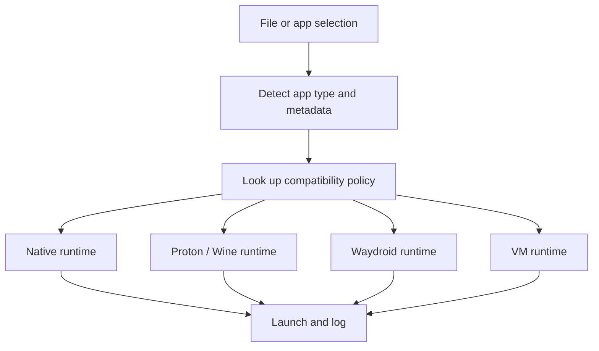

# Compatibility Launcher Design

## Purpose

The launcher is the user-facing control plane for starting apps and games. It decides whether an item is run natively, with Proton/Wine, within Waydroid, or under a managed VM. It does not secretly do unsafe things; it makes compatibility choices explicit and inspectable.

## Intake flow

## Policy rules

- Only run an app with the runtime the compatibility policy explicitly supports.
- Show the user the status before launch: supported, supported with notes, or unsupported.
- If an anti-cheat title is unsupported, mark it clearly and refuse launch unless the user explicitly overrides the warning.
- If a tool requires a VM or Android runtime, display its isolation and security boundaries before starting.
- Never auto-download and auto-execute arbitrary DLLs from an untrusted source.

## Runtime selection model

| Artifact | Recommended adapter | Notes |
|---|---|---|
| Native Linux app | Native package / Flatpak | Preferred path |
| `.exe` or `.msi` | Wine or Proton prefix | Use per-app isolated prefixes |
| Steam game | Proton adapter | Use the storefront and runtime selected by the user |
| Android app | Waydroid | Keep it isolated from the host |
| macOS workflow | VM / native alternative only if lawfully supported | Require explicit policy review |

## Operational controls

- user-owned prefixes and containers
- per-app logs and launch status
- uninstall/disable path for each runtime
- no silent host mutation
- save-game and configuration backup where supported

## Design requirement

The launcher must be a safe intermediary, not a root shell. It must call stable interfaces, respect permissions, and give the user confidence that the selected adapter is the right one for the task.
