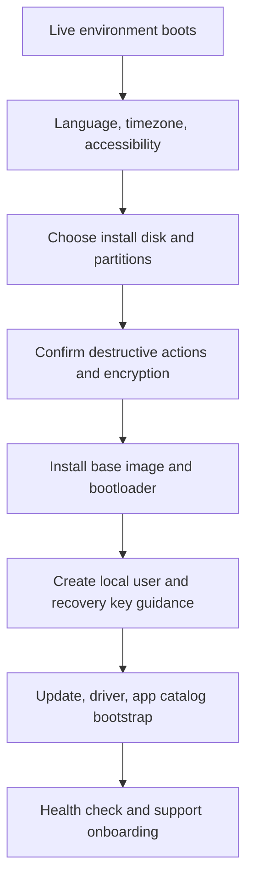

# Installer and First-Boot Design

## Purpose

The installer is not just a bootstrap tool; it is the first opportunity to establish trust, transparency, and safe recovery. A poor installer undermines the entire operating system.

## Operating constraints

- Must support UEFI boot and fallback boot options.
- Must differentiate between clean install, upgrade, and recovery mode.
- Must not silently erase a data partition.
- Must allow secure disk encryption with a clear recovery path.
- Must show the exact storage changes before they are applied.

## High-level flow

## Required installer checks

- verify and show disk layout before writing
- confirm whether the disk is SSD or spinning disk and show expected install behavior
- ask whether the user wants encryption
- show the specific restore and recovery procedure if encryption is enabled
- require explicit confirmation before wiping a disk

## Recovery requirements

- recovery USB or live image path must exist before beta release
- recovery instructions must be independent of the installed system being healthy
- user data backup guidance must be clear and non-ambiguous

## First-boot validation

After installation, the first-boot flow must confirm:

- time zone and locale
- network and driver detection
- GPU support status
- audio interface detection
- optional app catalog initialization
- update channel selection

## Beta gate requirement

The installer and first-boot system are beta-eligible only after a successful install, recovery, and rollback drill on the supported hardware matrix. Without this, the beta label is unsupported and misleading.
