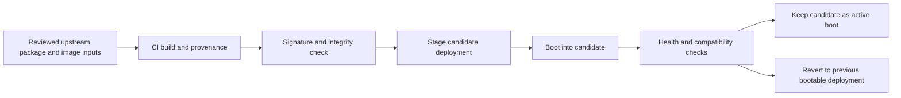

# Update and Rollback Design

## Purpose

The update system must be predictable, signed, reversible, and transparent to the user. The project cannot ship a distribution that quietly leaves the user with a broken boot path after a failed upgrade.

## Architecture

## Design principles

- One supported base image path, not a mixture of ad hoc update mechanisms.
- Candidate updates are created as a new deployment, not in-place mutation of the active system.
- Known-good deployment remains available until the candidate passes health checks.
- Update failure must not require developer intervention to recover the system.
- User-visible states must be readable, e.g. `installed`, `rolling back`, `reverted`, `healthy`.

## Required update actions

1. verify packages and image signatures
2. stage the candidate image
3. reboot with the candidate selected
4. run a short integrity and compatibility health gate
5. either accept the candidate or roll back to the prior one

## Rollback policy

- If the system does not boot cleanly, the bootloader must select the last known-good deployment.
- If the candidate boots but fails GPU, audio, or compatibility validation, the system must restore the previous deployment with a user-notice.
- If update is interrupted, the system must remain in a recoverable state.
- The user must be able to identify which deployment is active and what the previous deployment was.

## Security controls

- signed base images and metadata only
- reproducible build provenance
- known-good manifest of package inputs
- allowed rpm or image sources only
- explicit key rotation and revocation policy

## Alpha 1 expectation

The system may still be a prototype, but the update/rollback design must be documented, tested, and made reviewable long before Beta. Without this, the project is not a real operating-system program.
